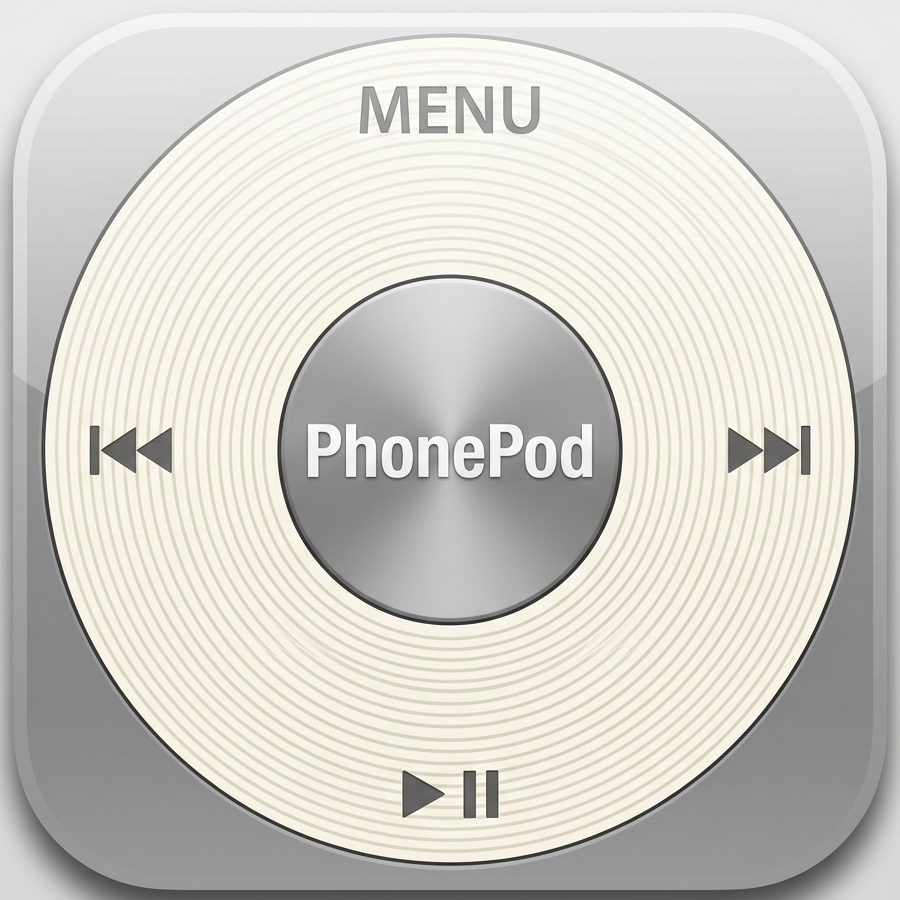

# PhonePod



Приложение в стиле iPod Classic (кликвил + скролл) для джейлбрейкнутых устройств на iOS 6–8.
Собирается через Theos на GitHub Actions без macOS (`ubuntu-latest` + linux-toolchain).

<br clear="left" />

## Функционал
- Список треков из библиотеки музыки (`MPMediaQuery`)
- Управление колесом: навигация по списку скроллом, выбор — центр, MENU — назад, play/pause/next/prev — по краям
- Экран Now Playing: обложка, название, исполнитель, прогресс-бар, громкость — скроллом колеса
- Раздел Фото: просмотр фотографий из галереи (`AssetsLibrary`) — сетка миниатюр + полноэкранный просмотр
- Настройки: выбор языка интерфейса (English / Русский)
- Иконка приложения 57x57 / 114x114 (`Resources/icon.png`, `Resources/icon@2x.png`)

## Установка на устройство
1. Забрать `PhonePod.ipa` из artifacts после сборки Actions.
2. Установить через Filza (`Install`) или Cydia Impactor на устройство с джейлбрейком iOS 6–8 (тестировалось под iOS 8.4.1 на iPhone 4S).

## Локальная сборка (если есть Linux с уже настроенным Theos)
```bash
export THEOS=~/theos
make package FINALPACKAGE=1
```
Готовый `.ipa` появится в `packages/`.

## Структура
- `main.m`, `AppDelegate.*` — точка входа
- `PhonePodViewController.*` — экраны меню, библиотеки, Now Playing, настроек и фото
- `ClickWheelView.*` — кастомный кликвил (рисуется вручную)
- `Resources/Info.plist` — бандл, `MinimumOSVersion 6.0`
- `Resources/icon*.png` — иконки приложения
- `entitlements.plist` — фейксайн через ldid при сборке

## TODO / на будущее
- haptic-подобный отклик
- Плейлисты и поиск через MENU (сейчас только полный список песен)
